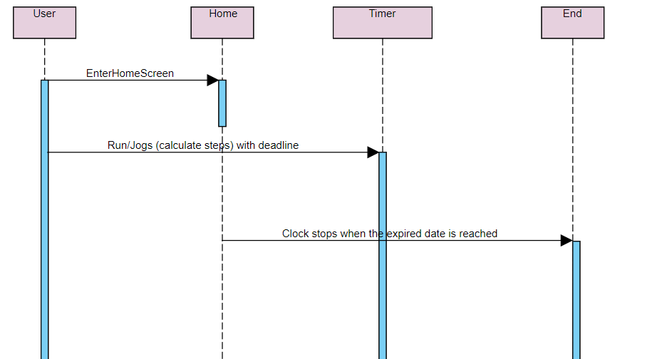

# Step Counter App

Group Members (Noor)
1. Zaiton Binti Ahmad Maideen (1523388)
2. Salwa Mittoulli ()

# To run the app
Run this code:
cd stepper/
npm install

## Available Scripts

In the project directory, you can run:

### `npm start`

Runs the app in the development mode. 
Open [http://localhost:3000](http://localhost:3000) to view it in the browser.

The page will reload if you make edits. 
You will also see any lint errors in the console.

## Introduction

Stepper is a simple mobile app where users could use this app to count their steps as they walk/run. This app also shows countdown of time and date set for users to achieve their goal. Unfortunately, the timer can be only set manually by the programmer for now. This app also provide nutritional facts on food and amount of calories burnt for the number of steps. Other than that, this app also has BMI calculator where user to use it to track their weight. This app is developed by beginners. So it may not be as beneficial yet. Progress to the app will be made in the future for better user experience.

## Objective

1. To function as a one time step counter
2. To allow users to watch their calorie intake and calorie burnt throughout the process
3. To allow users to measure their BMI

## Features 
1. Step Counter
2. BMI Calculator

### API Used
<ul>
  <li>react-navigation</li>
  <li>react-native-countdown-component</li>
  <li>react-native-speedometer</li>
</ul>

## Navigation
API used for navigation is react-navigation-stack in order to create drawer menu (side menu)

## Sequence Diagram

